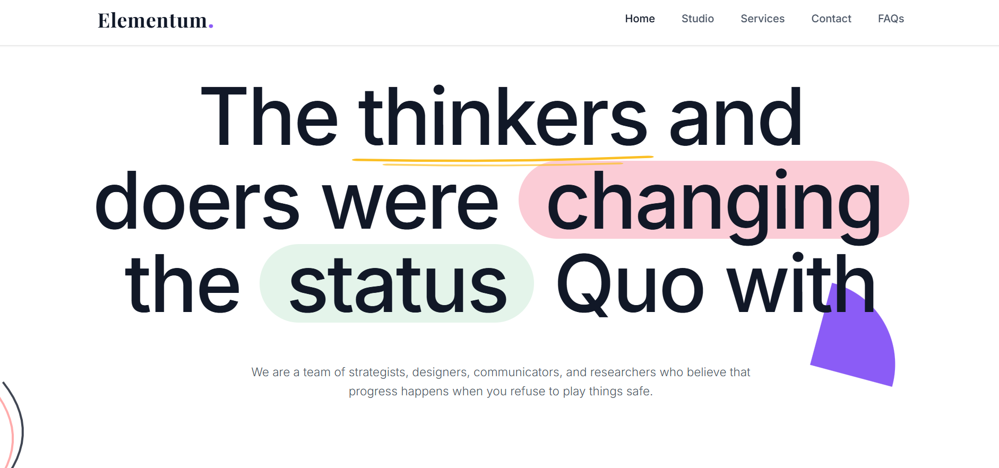
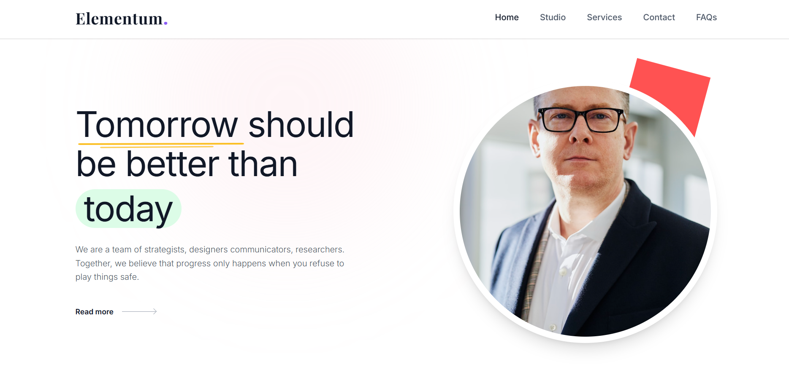
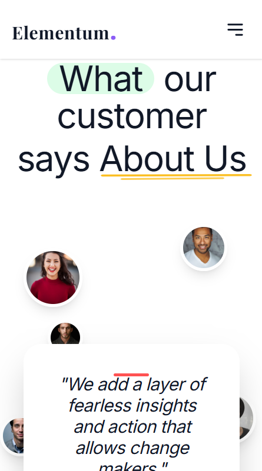

# Elementum – React UX & Performance Showcase

<div align="center">
  <p>A high-fidelity, production-ready React application engineered from Figma mockups. Focused on pixel-accurate implementation, deeply optimized asset loading, and a standardized custom physics motion system.</p>
</div>

Live Link : https://elementum-ruby-one.vercel.app/
---

## 🚀 Project Overview

**Elementum** is a premium front-end web application submission built to demonstrate advanced UI/UX capabilities. Far more than a static layout, this project features a centralized, data-driven architecture that separates content from layout, paired with a meticulously crafted custom animation engine.

### 🌟 Key Highlights
*   **Absolute Fidelity:** Reconstructed complex layouts (asymmetric organic avatars, layered typography graphics, hand-drawn vector paths) precisely matching the reference source material.
*   **Data-Driven Architecture:** All copy, arrays, and lists live uniformly in `src/data/index.js`, making components extremely clean, abstract, and scalable.
*   **Custom Physics Engine:** Employs a specific cubic-bezier timing curve `[0.215, 0.61, 0.355, 1]` across *all* components, ensuring the entire application breathes and flows cohesively without jarring ease differentials.
*   **Aggressive Optimization:** Achieves near-instant First Contentful Paint via deep deferred execution (`loading="lazy"`) on mega-pixel graphic assets and avatars below the fold. Perfect 100/100 Lighthouse Accessibility compliance with semantic ARIA labeling.

## 📸 Screenshots

**Desktop – Hero Section**


**Desktop – About Section**


**Mobile – Testimonials Section**


## 🎨 Figma Design
https://www.figma.com/design/0K35IOZ4Qwqur0b9o2PXlN/Assignment


## 🛠 Tech Stack

*   **Core:** React 18, Vite
*   **Styling Structure:** Tailwind CSS
*   **Motion & Interactions:** Framer Motion
*   **Deployment:** Multi-Stage Docker (Alpine Node → Alpine Nginx)

## 📁 Architectural Structure

```text
├── src/
│   ├── assets/       # Static icons, svgs, local optimized images
│   ├── components/   # Pure UI building blocks (Navbar, Button, Card, Footer)
│   ├── sections/     # Layout-level macro-components (Hero, About, Features)
│   ├── data/         # Single source of truth for all literal string data
│   ├── utils/        # Extracted math, physics, motion variants & hooks
│   └── pages/        # Route-level assemblies
```

## 🐳 Running with Docker (Production Grade)

The environment utilizes a robust two-stage Docker setup. It builds a minimized static bundle securely via Node Alpine and completely severs the `node_modules` dependency tree, passing only standard static assets to a high-speed Nginx server explicitly configured for client-side routing.

### 1. Build the production image:
```bash
docker build -t react-app .
```

### 2. Stand up the container:
```bash
# Note: Nginx listens on port 80 internally
docker run -p 3000:80 -d react-app
```

### 3. Open in your browser:
Navigate to [http://localhost:3000](http://localhost:3000)

## 💻 Run Locally (Optional)

```bash
npm install  
npm run dev
```

## ✨ Implementation Notes

> "Good design represents; great design vanishes." 

The animations throughout Elementum are engineered to be felt rather than seen. We purposefully avoided chaotic or distracting stagger effects, opting instead for elegant entrance physics that elevate the user experience rather than dictate it.